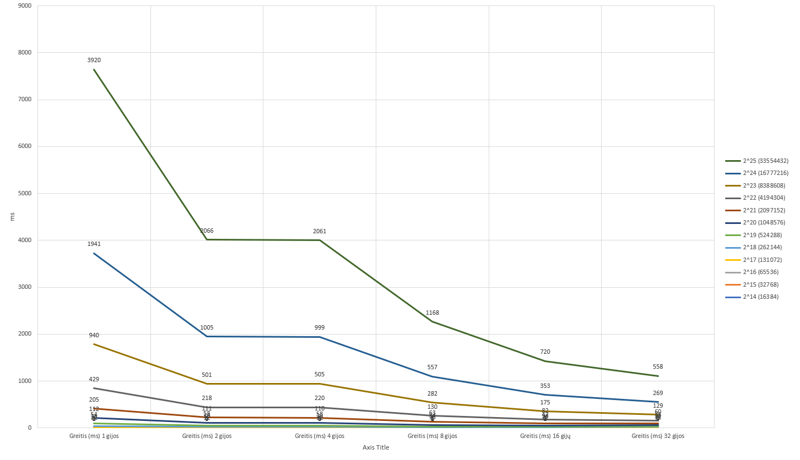
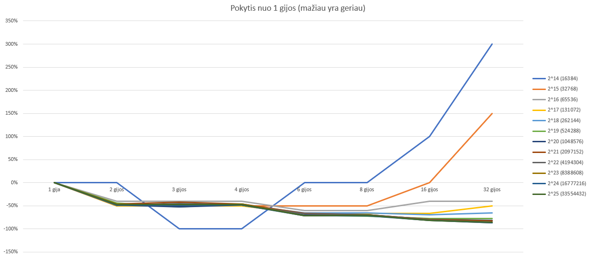
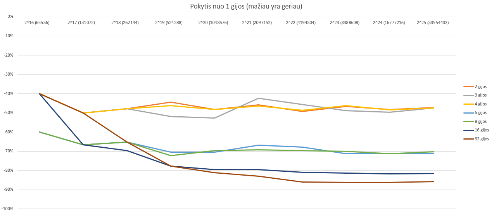

## 3. Masyvo elementų rūšiavimas "suliejimo" pavidalo metodu
(Galite nustatyti, kad masyvo dydis 2-ju laipsnis).  
Gugliafrazė: "merge sort"  

Tema: Lygiagretus masyvo rikiavimas "merge sort" metodu.

Aprašymas:
Programa demonstruoja, kaip masyvas rikiuojamas keliomis gijomis,
kurios veikia lygiagrečiai. Darbas paskirstomas dinamiškai –
kai gija baigia rikiuoti savo dalį, ji gali būti panaudota kitiems darbams.

Kvietimo pvz.:
<code>
java ParallelMergeSort 4 1048576 fast
</code>

Parametrai:  
`args[0]` – gijų skaičius  
`args[1]` – masyvo dydis (turi būti 2^k)  
`args[2]` – režimas: "debug" arba "fast"

## Testavimas
Testavimas atliktas 100 kartų išvedant vidurkius.

| Masyvo dydis      | Greitis (ms) 1 gijos | Greitis (ms) 2 gijos | Greitis (ms) 3 gijos | Greitis (ms) 4 gijos | Greitis (ms) 6 gijos | Greitis (ms) 8 gijos | Greitis (ms) 16 gijų | Greitis (ms) 32 gijos |
|:------------------|---------------------:|---------------------:|---------------------:|---------------------:|---------------------:|---------------------:|---------------------:|----------------------:|
| 2^14 (16384)      |                    1 |                    1 |                    0 |                    0 |                    1 |                    1 |                    2 |                     4 |
| 2^15 (32768)      |                    2 |                    1 |                    1 |                    1 |                    1 |                    1 |                    2 |                     5 |
| 2^16 (65536)      |                    5 |                    3 |                    3 |                    3 |                    2 |                    2 |                    3 |                     3 |
| 2^17 (131072)     |                   12 |                    6 |                    6 |                    6 |                    4 |                    4 |                    4 |                     6 |
| 2^18 (262144)     |                   23 |                   12 |                   12 |                   12 |                    8 |                    8 |                    7 |                     8 |
| 2^19 (524288)     |                   54 |                   30 |                   26 |                   29 |                   16 |                   15 |                   12 |                    12 |
| 2^20 (1048576)    |                  112 |                   58 |                   53 |                   58 |                   33 |                   34 |                   23 |                    21 |
| 2^21 (2097152)    |                  205 |                  111 |                  118 |                  110 |                   68 |                   63 |                   42 |                    35 |
| 2^22 (4194304)    |                  429 |                  218 |                  233 |                  220 |                  138 |                  130 |                   82 |                    60 |
| 2^23 (8388608)    |                  940 |                  501 |                  481 |                  505 |                  271 |                  282 |                  175 |                   129 |
| 2^24 (16777216)   |                 1941 |                 1005 |                  978 |                  999 |                  560 |                  557 |                  353 |                   269 |
| 2^25 (33554432)   |                 3920 |                 2066 |                 2057 |                 2064 |                 1134 |                 1168 |                  720 |                   558 |

Tarp 1 ir 2 gijų skirtumas ženklus.  
Kaip matome tarp 2 ir 4 gijų toks pat greitis.

### Analizė

## Procentinis pagreitėjimas nuo 1 gijos (visi duomenys)

| Masyvo dydis      | 2 gijos % | 3 gijos % | 4 gijos % | 6 gijos % | 8 gijos % | 16 gijų % | 32 gijos % |
|:------------------|----------:|----------:|----------:|----------:|----------:|----------:|-----------:|
| 2^14 (16384)      |         0 |    -100 % |    -100 % |       0 % |       0 % |     100 % |      300 % |
| 2^15 (32768)      |     -50 % |     -50 % |     -50 % |     -50 % |     -50 % |       0 % |      150 % |
| 2^16 (65536)      |     -40 % |     -40 % |     -40 % |     -60 % |     -60 % |     -40 % |      -40 % |
| 2^17 (131072)     |     -50 % |     -50 % |     -50 % |     -67 % |     -67 % |     -67 % |      -50 % |
| 2^18 (262144)     |     -48 % |     -48 % |     -48 % |     -65 % |     -65 % |     -70 % |      -65 % |
| 2^19 (524288)     |     -44 % |     -52 % |     -46 % |     -70 % |     -72 % |     -78 % |      -78 % |
| 2^20 (1048576)    |     -48 % |     -53 % |     -48 % |     -71 % |     -70 % |     -79 % |      -81 % |
| 2^21 (2097152)    |     -46 % |     -42 % |     -46 % |     -67 % |     -69 % |     -80 % |      -83 % |
| 2^22 (4194304)    |     -49 % |     -46 % |     -49 % |     -68 % |     -70 % |     -81 % |      -86 % |
| 2^23 (8388608)    |     -47 % |     -49 % |     -46 % |     -71 % |     -70 % |     -81 % |      -86 % |
| 2^24 (16777216)   |     -48 % |     -50 % |     -49 % |     -71 % |     -71 % |     -82 % |      -86 % |
| 2^25 (33554432)   |     -47 % |     -48 % |     -47 % |     -71 % |     -70 % |     -82 % |      -86 % |

Matome, kad su mažais kiekiais (2^14–2^15) - didėjant gijų skaičiui - procentiškai letėja greitis.

## Procentinis pagreitėjimas nuo 1 gijos (2^16 - 2^25)

Išėmus duomenis, kurie letėja (2^14–2^15) ir žiūrint tik 2^16–2^25 duomenis - matome, kad daugėjant duomenim - gijų darbas reikšmingai neletėja (nekyla į viršų).

