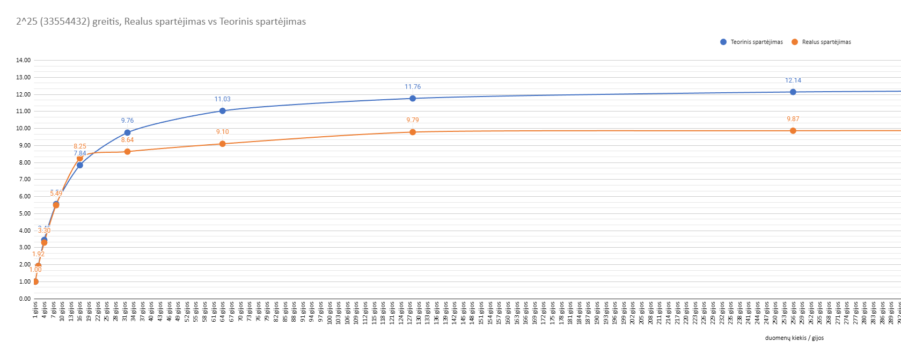

Kaip matome iš grafiko, realus spartėjimas nuo 1 iki 16 gijų beveik toks pat. Bet nuo 32 gijų iki 512 jau atsilieka 1-3 kartais.

Tiek teorinis, tiek realus spartėjimas suplokštėja ir nebespartėja

|                               |           | teorinis spartinimas |
|-------------------------------|-----------|----------------------|
| n                             | 33554432  |                      |
| tserial (sequantial time (T1) | 838860800 |                      |
| tparalel 2                    | 436207616 | 1.923076923          |
| tparalel 4                    | 243269632 | 3.448275862          |
| spartinimas 8iems             | 150994944 | 5.555555556          |
| spartinimas 16iems            | 106954752 | 7.843137255          |
| spartinimas 32iems            | 85983232  | 9.756097561          |
| spartinimas 64iems            | 76021760  | 11.03448276          |
| spartinimas 128iems           | 71303168  | 11.76470588          |
| spartinimas 256iems           | 69074944  | 12.14421252          |
| spartinimas 512iems           | 68026368  | 12.33140655          |
